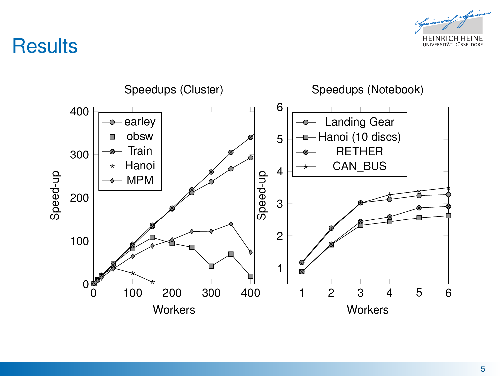
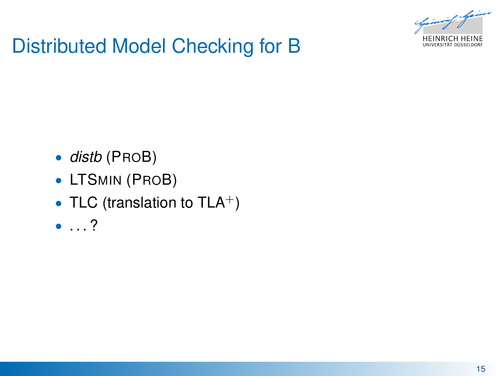

# plspec

* **Speaker: Philipp Körner**
* **Conference: NFM 2018**
* Script type: Manuscript

Thank you and hi everyone.
I'm going to give you an overview about a tool I named distb.
It is an extension for ProB and distributes model checking work on multiple CPU cores or machines.

I want to start with a basic explicit state model checking algorithm.
That is what ProB is capable of - amongst other stuff like LTL or symbolic model checking.
Basically, we start in a state where there are no results yet.
We got a specification that contains some initial states that we put in a queue and mark these states as seen.
Then, we keep working on the queue, pop a state and check the invariant.
Afterwards, we calculate successor states that will be enqueued if they were not seen yet and be marked afterwards as well.
Also, we have to check whether a desired property holds, e.g., that there are no deadlocks or all invariants are satisfied.
At the end of the day, we return all results we collected.

So, let's have an intermediate goal.
Let's build a parallel model checker.
We just start up some threads that work on the queue.
If in doubt, we throw in some mutexes to avoid concurrency issues and we're done, right?

For a distributed version, there are some requirements.
Firstly, we do not want to check the same state over and over again.
Otherwise, we don't get any faster if every worker does the entire work.
Thus, we need to keep the seen set as consistent as possible an all machines.
New information has to propagate fast.

Secondly, we only have limited bandwidth.
If we congest the entire bandwidth, the entire thing breaks and slows down very much because the seen set is not updated in time.
That also means that communicating states should be avoided.
Lastly, we want to avoid network latency when possible.
Retrieving information from other machines can take quite some time.
The other end has to be ready and, additionally, we get the network delay.

So let's break our parallel model checker again.
ProB is written in Prolog.
That means, no threads.
So we have to take a different route here.
What's special about B and Event-B, the two formalisms ProB is the state-of-the-art model checker out there, is that they are very expressive.
A single state transition can be thousands or tens of thousands state transition in a low level formalism, like Promela.
Compared to SPIN, the next-state function is very slow.
But that gives us some more time for distribution overhead.
Finally, the models we are looking at have relatively few states, as long as they are finite.
I claim that checking a billion states of a real world model has not been done.
That's a number that SPIN laughs about.

Let's take a look at the results first.
It would be a pity if I was cut off without showing them to you first.
Afterwards, I'll be telling you how we've done it.

So on the right-hand side, we see speed-ups on my notebook here.
It is a quad-core and, surprisingly, it scales up to three workers because one core was used otherwise.
Then, hyper-threading kicks in and we see a little more gain, but that's it.

On a high performance cluster with hundreds of CPUs, that's where it gets interesting.
Look at the Train model first.
That's a perfect match.
It's from the B-Book by Jean-Raymond Abrial and models an interlocking system.
The baseline for a single core is a conservative estimate.
You can run it with ProB, we got a 100 GB memory limit.
Give it three days and it runs out of memory and has seen about half the state space.
distb, however, scales for 400 cores almost linearly.
We can check it in less than half an hour.
That's turning "impossible" to "over lunch".
On Amazon, that's ten bucks to save a week's pay on an expert.

Then, we got the Earley Parser model.
It was also written by Abrial.
It scales pretty good as well.
With vanilla ProB, it runs for several hours.

There's also the MPM, that's short for Mode Protocol Machine and the obsw, which are both contributed by Space Systems Finland.
I thought they might be a nice match for this conference.
They don't scale as good, but we are able to speed up by two orders of magnitude.
That's because they run less than an hour and you don't get much faster than half a minute including parsing time.
But we can see that there is a point where it gets worse once you add more workers.

Lastly, we have a model of the Towers of Hanoi using 15 discs.
This model does not scale nearly as well, but we expected this.
It was included for this exact reason.
We understand that the state queue collapses on a regular basis back to one state, when there is only one possibility to move the largest disc.

Okay, so when does a model actually benefit from distributed model checking?
From our experience, we can get pretty good speed-ups as long as it is not a counter and as long as its state space is big enough.
We require at least some degree of non-determinism, so fully sequential models can not benefit, instead they suffer the overhead from distribution.
We also have no means to do any off-line partitioning of the state space.
As we understand, SPIN can abuse some semantics about processes to do so for Promela models.
But in order to get any reliable information about the state space, we have to explore it entirely.

So here's how the magic work:
since we got no threads, we just start multiple instances of ProB on each machine.
We have a single master which is a ProB.
It kicks off the model checking with an artificial initial state and coordinate the process.
The workers are the only components that perform actual progress-oriented work.
We also got proxies between the master and workers which intercept communication.
I'll get to that in a minute.
For now, just note that workers usually don't talk with the master directly, and neither with other workers.

The communication happens via ZeroMQ, which is a great framework for distributed messaging.
If you ever want to link two processes, use that library.
Just trust me on that one.
It has some great patterns we can employ.
First up is request-reply, which automatically routes the answer to whoever sent the request.
We use it for everything that is related to ID distribution, like when the master assigns an ID to the proxy or a proxy to workers.
Then, we got push-pull, where multiple instances push their messages into a single sink.
Workers push all their progress to their proxy, which in turn push it to the master.
Then, there is publish-subscribe.
The master re-distributes all incoming information back to the proxies.
Proxies might publish to other proxies as well, we will come to that in a minute.
They also translate or send new commands to the workers.
Finally, workers can receive work via a reply-socket.
So, when work items are transferred, it's a "can you please take this", and their request is acknowledged.

As I mentioned earlier, ProB is written in Prolog.
So, all the messaging stuff and most logic is written in C.
Passing a state to C from Prolog is quite a challenge.
States are represented as ordinary Prolog terms and a term reference cannot be shared over network.
Hence, it has to be serialized in order to send it to another worker, or even to hash the state.
We'll talk about hashes in a second.
We use an undocumented library that is named fastrw, that's fast read/write.
It avoids costly parsing, but it isn't really cheap either.
However, it's still better than purely textual, human-readable representations.

So, hashes.
Each encountered state is hashed and these hashes are communicated.
A full state, that is the entire Prolog term, is only communicated if another worker should check it.
That's only reasonable, seeing a state might be even several hundred megabytes in size.
Communicating that each time would be quite a pain.
Thus, we have to assume, that the same hash code implies that it's the same state.
In order to do so, we use SHA-1 as a default.
That seems like a good trade-off between size and probability of a collision.
For any model we can handle, a collision is quite unlikely.
For a billion states, it's 2 to the power of -100.
It's probably more likely that cosmic rays will flip bits in your memory.
TLC uses 32-bit hashes, or used them up to recently.
That's actually bad.
It's likely you get a collision once you exceed a few million states.
Last I've heard, they prepared to switch the hash function for this exact reason.

The reason we use a cryptographic hash function is the data structure that we use.
It's called Hash Array Mapped Trie, and Trie is not a typo.
Basically, it's a prefix tree plus storage of the hash code and value.
For words, we might use a 26-ary prefix tree, that's actually a 27-ary tree, one for each letter and an end-of-word symbol.
To look up a word, we follow the prefix, that is each letter individually.
If we end up in leaf, we compare it and either find it or not.
To insert, we do the same.
If there is a leaf already, it's pushed down a level and the insert operation re-tries there.
In reality, we use a 32-ary tree and use 5 bits per level in order to determine the position.
That's how Clojure does their immutable maps.
Usually, it's more memory-efficient than storing a hash map, since a good loading factor is about ten per cent.
The cryptographic hash function ensures that the hashes are about uniformly distributed, and, thus, the tree does not grow as much in height.
For a million states, the maximum depth is less than 8, and we have never seen a depth higher than 10 in practice.

Eventually, workers have to share their work queue with other workers.
The first thing that comes to mind is that workers always communicate their queue sizes when they change.
That's a bit heavy on the network.
So they pass this information to their proxy, but it distinguishes three states:
a worker is empty, or working but the queue size is below a threshold so it should not share its work, or it can share.
This fingerprint is passed to the master since it usually does not change as often.
The master then can decide when work transfers should happen between machines.
Proxies are responsible for their own workers.
Transfers on the same machine are always perferred over transfers between multiple machines.

So that's one reason for a proxy.
To be honest, it was introduced as a hack.
You've seen how many sockets we use per component, and each socket uses a file handle.
Thus, the master had more than a thousand file handles open and on our cluster things start to act up once you use more than 1024 sockets.
A proxy moves most file handles into another process and gives us about a factor of 20 more workers.
Also it reduces bandwidth consumption, since not all information has to find its way to the master.
Some decisions are totally fine to be made locally.
Additionally, it serves as a coordinator for shared memory.
That hash trie we have seen resides in shared memory.
Maintaining multiple copies would be a waste.
Ensuring a consistent view is kinda nice.

The proxy can reduce bandwidth consumption on the master even further.
If we look at peer-to-peer streaming techniques, they use such an application-level multicast.
Then, the master does not have to use its bandwidth for all participating machines but only for a small amount, say two.
Each proxy publishes everything that comes in to another to proxies, if they are available.

To wrap it up, here's what I know about distributed model checkers for B.
There's distb, I've told you about it.
There's LTSmin that usually kicks ProB's behind, but it also uses ProB as its language frontend.
I claim that they don't scale as nicely currently, because caches are not shared amongst workers.
Then there's TLC, which is a distributed model checker for TLA+.
But we have a translator into that formalism, and also in the other direction.
I don't know whether there is anything else out there, but a survey on distributed model checking would be interesting to say the least.
I think there are many techniques that should be shared.
I know of SPIN, DiVinE, PREACH and a few more, and they all got some great ideas.
However, due to the differences in their input languages, a comparison is really hard.

Okay, I just said that, there are some interesting techniques that we can use.
We got a mutable version of a functional data structure for visited states.
We reduce bandwidth by looking what the peer-to-peer guys are doing.
And it works quite well for a high level formalism like B.
The longer the interpreter takes, the more room there is for the distribution overhead not to matter.
SPIN suffers entirely different problems, for example they have to distribute their seen set as well.
And, most importantly, we improve on the current tooling for B and Event-B.
Now, we can check larger models that were infeasible before.
And instead of taking a week, we can just go on a lunch break, grab some coffee and it's done.

Thank you very much.
