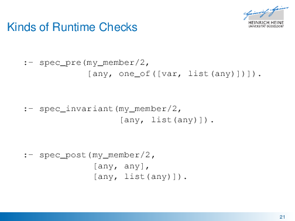
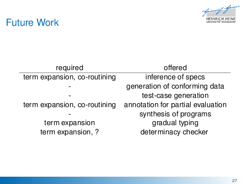

# plspec

* **Speaker: Philipp Körner**
* **Conference: Declare 2017**
* Script type: from memory

Thank you. First of all, I have to admit that I lied.
While plspec is a type system for Prolog, this is not what this talk is going to be about.

Instead, I'll go with this title.
plspec is intended to be a specification language for data.

What this is actually about is documentation.
We should be able to describe how data looks to our fellow programmers.

Furthermore, plspec is about change and growth.
If you are into that, you should watch this great talk by Rich Hickey named "Spec-ulation".
It's on YouTube, give it a shot if you got the time.

And, to be totally honest, this is going to be a rant.
So don't worry, I'm going to go light on you.
We won't go into technical details for quite a while.

So coming from that, it might not surprise you that I'll claim that non-ISO Prolog is broken.
By this, I mean it's not broken inherently but what something that we do with it all the time.

Let's look at a very basic predicate, member/2 and its documentation in SWI.
I might have as well picked the one from SICStus, and it does not matter. It basically says the same.

So, member takes two arguments, an Elem and a List.
And it is going to be true, if Elem is a member of List.

We all know this predicate.
But I'm wondering, is that good documentation?

[Pause.]

Yeah, you could argue "this is what it does".
And what we get here is not wrong at all.

However, this second case where it says false,
this is already undefined.
The entire documentation is an implication, it says "true, if...".
It does not say what happens otherwise.

1 is a member of the list [1,2,3], 0 is not.
We can also put a variable there instead and we get all elements in the list.
So what is the issue here?

[Audience: the second argument might not be a list.]

Exactly! What will happen if we put something else there instead?

As a quick reminder, a list is defined inductively.
A list is either a list terminator like the empty list
or a list constructor like the dot that is passed a new element in front of a list.
Instead of the dot, SWI uses this fancy constructor now.

So okay, the atom a is not a member of the atom a.
That's fine. This is what we would expect, even though it is not documented.

Based on the definition above, a list with a front element a and the rest of the list that is the atom b
is not a proper list. We can see that.

But when we pass this to member, it answers true.
This is actually horrible.
This means, if the second argument is not a list, the behaviour is absolutely undefined.
It may say yes, it may say no.

Let's try to fix this documentation.

member returns true if list is a proper list and Elem is a member.
Additionally, it returns false if it is not a member.
We should document this as well.

There might be variables and we can cope with them.
And if the list is not a proper list, it's all over.
This is not defined.

This documentation probably is not complete as well.
Writing documentation is hard.
And that's the point.

Often, we work with data that is more complex than a list.
We have nested data structures and ordering matters.

Let's take a quick look at what behaviour is actually possible.

It is possible for the predicate to succeed. That is a yes and we get bindings.
From a programmer's point of view, this is what we want.

Often, predicates fail. This should signal that there is no solution.

Sometimes, we see errors that signal something absolutely went wrong.

And, actually, there's a fourth possibility: the program might run into an infinite loop. But we might ignore that.

I want to show to you an example that actually happened to show you where I'm coming from.

Between Christmas and New Year's, I've been working on a version of a CSP interpreter.
When I say CSP, I do not mean the one you all were talking about before,
I mean the process algebra by Hoare.

CSP has the concept of channels where the processes pass values.
Someone writes it on them, someone reads it.
I needed to evaluate an expression on the channel.
The code for this already existed.
My version of the interpreter just is about having more fine-grained control.

So that is the predicate that was called in the old interpreter.
It takes six arguments:
some values, a channel expressions, a list of evaluated values -
I'm wondering, is this going to be a proper list? - 
the channel itself, some source span information and a WF.
Since I'm working with this group for a while, I know this is a wait flag.

So I tried something, and it said no.

Now, imagine I'm sitting there, I've got my AST, I've got my environment
and all I want is to call this piece of code.
There's nothing here that gives me any information about how I should call it.

So I look at the next predicate, evaluate dot tuple.
This won't help me either.
Remember, I'm reading other people's code already.
But now, I've got to follow the entire call chain.
A calls B, B calls C, C calls D, and so on.
Maybe at Z I get some information about the type.
Maybe I need even more predicates.

Now I'm trapped in a module consisting of 1000 lines of Prolog code.
I'm not going to understand this in an hour or even an afternoon.
But my call should be a quick fix.

What can I do at this point?
Do I have any options?

Well, I could try to read and understand a thousand lines of foreign Prolog code.
But, spoiler alert, this is not going to happen.

Then, I could go ask my boss.
He is better at reading Prolog than me.
But he has not written the code either, the guy who did left the group a while ago.
So he would have to read that code for me as well.
Now, I have to wait for him so I can waste our both's time.

Lastly, I can stop working on this and do something else.
This isn't helping anyone now.

Now to come back to my bold claim earlier.
ISO Prolog does something nice.
It usually does not say no.
If the type of an argument is wrong, it raises a type error. 
Otherwise, it usually just works.

So, why don't we have nice things as well?
We could just check the type in each predicate ourselves.
Of course, it eats up performance.

But look at it this way.
No really, when did just saying no become hotter than raising an error?

And even if we think about, an error saying "oop, you got it wrong" is not helpful enough.
Just tell me, what I need to know. What should I pass instead?

I hope this motivates sufficiently where I'm coming from.

As I said, I was working on this, got angry and went to Sebastian.
My boss was on vacation, after all.
I could not do what I wanted to do in a proper timeframe.
This sucks. It should not be like that.

So here's my rationale.

Documentation is not enough.
I mean, my group in particular is not famous for its great documentation.
But it is a problem that we all have, don't we?

Then, we change our code. We do it all the time.
Do we fix our documentation when we do? Probably not.
It gets outdated.

Thus, we should somewhat be able to enforce our documentation in some way.

Maybe, if only we could describe - at least some part of our program - with some more Prolog data?

I was going for some fancy effects on that slide, but this is hard in LaTeX.

After I cried for some time, we worked on plspec.
Since then, I think it got into state that it should be useable.
It's a library, it's open source, it's just a Prolog file.
You can just download it and drop it into your project.
Feel free to use it for yourself or read into it.
It got a lot... well, I have written quite a bit of documentation.

And I want to emphasize that this is not something new.
It is heavily inspired by clojure.spec since Clojure is my favorite language.

There is lots of basic software engineering like design by contract, as in Racket.
There's Mercury, we have lots of typed Prologs.
Even in Erlang, the specification language is very similar.

Basically, it's all been done before but for me, this is not an option.
I'm stuck on SICStus Prolog since my boss wants to use that.
I don't have access to Ciao Prolog or Mercury.

So we've written a library that does that thing for me.
We've tested it on SICStus and SWI.
Unless you use an esoteric Prolog, it should work for you as well.

We've added a lot of built-ins into plspec.
This should suffice to describe everything
we can build with Prolog's type system.

There's any, which matches any value.
There's all the scalar types
and we can describe compound values
by stating their functor and what types the arguments are.
We can describe homogenous lists as well as heterogenous tuples.
I understand a tuple to be a list with a fixed length.
This is not about thing that groups terms in round parenthesis.

With this, we can describe, for example, a tree of type X.
This definition says, "a tree is either the atom 'empty'
or a compound Prolog term whose functor is 'node',
the first and last argument is a tree of type X itself
and the term in the middle is the value of type X."

So, for example, the atom 'empty' is a valid tree of integers.
The tree containing only 1 is fine too.

It is more interesting to see which values are not okay:
tree of empty, 1 and empty is not valid.
The functor does not match.
It says tree instead of node.
I want to stress that this is a very subtle error.
It is something that I do all the time and, for me, this is hard to notice.
Now imagine that you sit in the debugger after your predicate said no
and you're just not seeing it.
It's not fun at all.

And, of course, the tree that only contains the value 'empty'
is not a tree of integers.

Then, I also might have - accidentially - introduced dependent types.
I'm not quite sure whether this was a good idea.

If I write my own predicate that checks a property for me,
I can use it.
This one is true for even integers and, thus, -2 and 0 are accepted
while 1 and 3 are not.

This was intended for developers who have written such predicates
for their own ad-hoc type checks.
I mean, why should you have to throw away your code
and re-implement everything in my language?
Just keep it.

I want to take a step back and stress that what we've got so far
is extremely valuable.
This allows us to define something and talk with our fellow coders.
Okay, I now understand what you mean when you say a tree.
And, as I've shown you, the Prolog interpreter understand these as well.

So we can use these annotations.
We can add more annotations to check the types of arguments of predicates,
at run-time.
For plspec, we've implement three kinds of run-time checks:
preconditions, postconditions and invariants.

The semantics are as follows:
for preconditions, I state all ways my predicate should be called.
At least one of them has to be matched, or I raise an error.
For postconditions, I state tuples of conditions.
If the first vector of types matches on entry of the predicate,
the second vector of types has to match if it succeeds.

I'm gonna talk about invariants in a second.

Now, we come back to our goold old member example.
Here is an incorrect call:
the second argument is not a list, but it is an atom.
Prolog would, normally, just say no.
With plspec, this just explodes.
This tells me "hey, your call is non-sense. Don't call my like this."

Invariants, on the other hand, are a bit tricky.
They assume that terms might not be fully instantiated yet.
They break down the term, look at the instantiated bits
and raise an error as soon as a single piece breaks.

If we say, something has to be a tuple [int, atom, int]
and I look at the variable T.
It is a variable.
It does not violate the spec, yet.
So if I unify T = [X, Y, Z], this is still fine.
The length of the list matches and no instantiation breaks it, yet.
When I say Z = 3, it is okay. Z is an int. So it works.
But if I break, say, Y, by unifying Y = [1, A, 3],
Y is not an atom and can never be one, not matter the value of A.
The invariants will break at this moment.
So we can understand invariants as
"we can unify variables in such a way that this spec will still be matched."

Invariants will still be enforced, even if the predicate already succeeded.
If in the example above, I get [X, foo, 3] back and I bind X to something
that might not become an int, it will explode in my hands.
So be aware of that.

Let's take a look at this example here.
Don't worry about the X = [1], X == [2].
This is failing in a sophisticated way so that the compiler does not
optimise away the unification.
It is meant to be some kind of programming error.
I say that my invariant is that the argument will always be atomic.

So if I call the predicate with the atom a,
the unification in the first rule will not succeed,
it matches the second rule and we're done.
What happens if I put a variable instead?
We will bind it to the list containing only 1. 
But this list is not atomic.
Thus, the invariant will break and we get an error.

We just found a programming error.
Note that no matter what unit test we would have written,
this cannot be exposed by that means.
We can do that.

Of course, we tried it ourselves.
And it works and the performance is totally okay.
But, of course there is a but,
instrumenting annotations of recursive predicates might not be a good idea.
It is slow.
If you got a list of thousand elements,
it will check the type of thousand elements.
You call it recursively with its tail
and it will check nine-houndred ninety-nine elements, and so on.
Also, because of the term expansion, we break tail-recursion.

But we can work around that:
just wrap the predicate and write an invariant.
This stuff is powerful.

Or, simply don't ship specs that are enabled for run-time checks.
They are meant to be a developer tool at best and they should document stuff.
You read them, and hopefully implement the correct call.

We have used it in ProB, it's an animator and model checker.
It consists of about one houndred thousand lines of Prolog code.
There was one nasty bug in particular:
there was an error in a calculation and we send the results to another tool.
That tool crashed with a segmentation fault.
Oh boy, finding out what caused this was lots of fun.
But, I figured it out, told my boss and he fixed it.

After I've written plspec, I was wondering.
I went back to that revision and wrote some specs for some predicates.
And, voila, it tells me the error immediately.
I wish I had it back then.

Also, I've made a colleague of mine use plspec.
Turns out, there were test cases that succeeded
but some arguments were just wrong.
So we might have one hundered percent test coverage
and still only test bogus.

So what is the deal.
If you use plspec, we offer you documentation for free.
And, again, I think this is really valuable.
If your system offers term expansion,
I can give you run-time checks.
And, lastly, if you have co-routines for me to use,
I can give you invariants.

But there's way more stuff we can work on.
What I want to work on is that you give me a series of data
and I give you a spec that matches.
Maybe we can try this in combination with a partial evaluator.
They tend to have that problem that you have to add annotations by hand.
If we sample enough data, maybe our guess is good enough.

We maybe can generate some other stuff, like sampling a spec.
The reasoning is, "I don't want to read all this stuff.
Just show me some data that is okay."
Once we got that, we can generate test cases
for predicates which must not fail if a certain precondition is matched.
I can imagine that we add such a flag to the annotations.

Maybe we can even use these annotations to generate entire programs.
Then, I can say "okay, I've got something of type lead and something of
type fire, please find me calls which then return me something of type gold."

Of course, we might also check some types statically.
Probably, this would bring us into the land of gradual typing.

Lastly, people have asked for a determinacy checker.
I've tried it but I did not find a way yet which is portable
between multiple Prologs and composes well enough
with our term expansion.
I feel like this is an entire separate library.

So, in order to wrap it up:
I'm a bad programmer.
I cannot deal with lots of code.
And I really don't want to read and understand all of it.

My goal was to be able to maintain Prolog code that I may
or may not have written myself.
Thus, I have written plspec which offers optional typing in form of a library.

Maybe you want to give it a shot and try it.
Maybe you will find it useful as well.

Thank you.
